# 第11章实验报告

[TOC]

## 实验一：使用私钥访问SSH服务器

### 实验原理

利用非对称加密算法生成一对公私钥对。私钥由自己保管，公钥对外公开，当用公钥对数据加密时，只有对应的私钥才能解密；用私钥对数据签名时，也只有对应的公钥才能验证。利用这一特性可以实现远程服务器对用户身份的认证。

用户可提前将公钥上传至服务器，当用户发起登陆请求时，用户用私钥对服务器发来的随机串进行签名，将签名结果返回给服务器，服务器收到后用公钥进行验证，如果一致则用户身份验证通过允许登陆。

### 实验环境

- 使用**VMware**安装虚拟机**Ubuntu22.04**并将软件源换成清华源

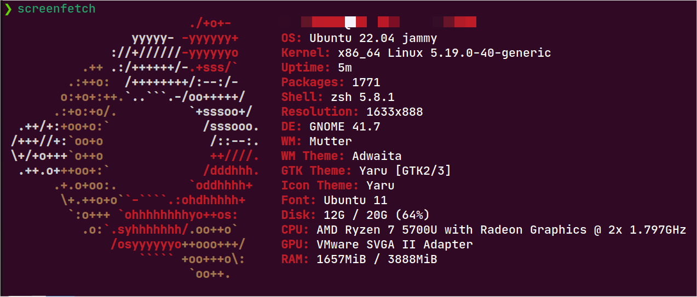

- 开启SSH服务

```shell
sudo apt update
sudo apt install openssh-server -y
sudo ps -e | grep ssh
sudo service ssh start
sudo service ssh status  # 查看SSH服务状态
```

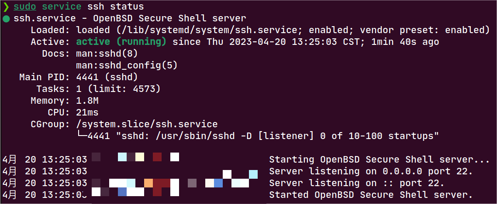

- 安装`net-tools`，使用`ifconfig`查看服务器IP地址

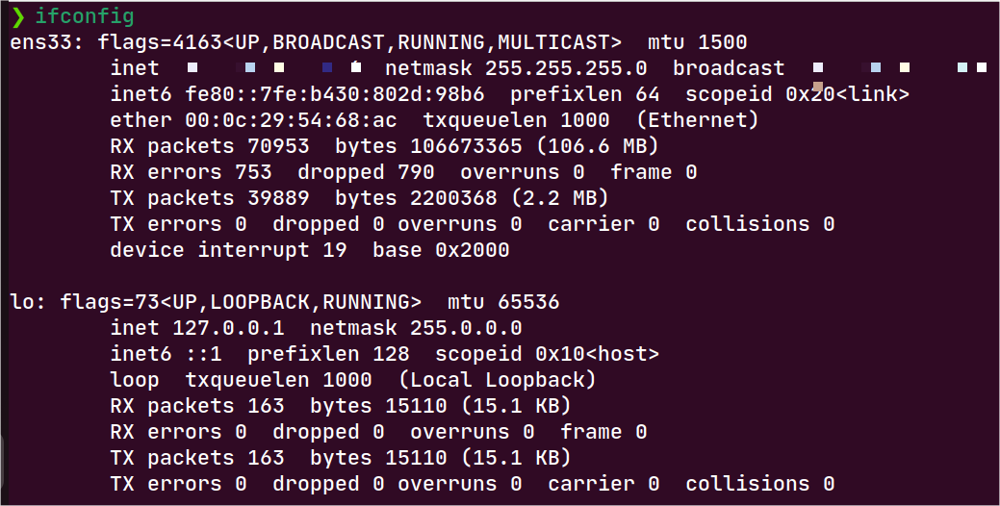

### 实验步骤

至此实验环境配置完成，下面开始实验“使用私钥访问SSH服务器”

- 使用**MobaXterm-Tools-MobaXterm SSH Key Generator**生成基于RSA的公私钥对

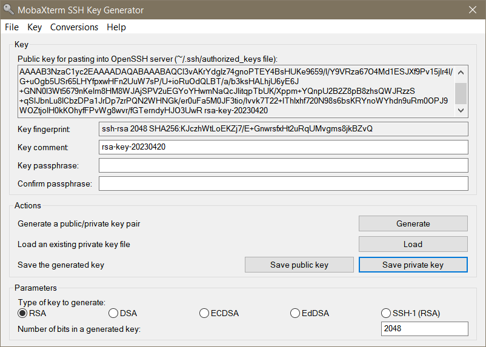

- 将公私钥分别保存为`mk.pub`和`mk.ppk`，创建公钥的副本`authorized_keys`

- 使用MobaXterm连接Ubuntu虚拟机（此时使用的是密码方式登陆）

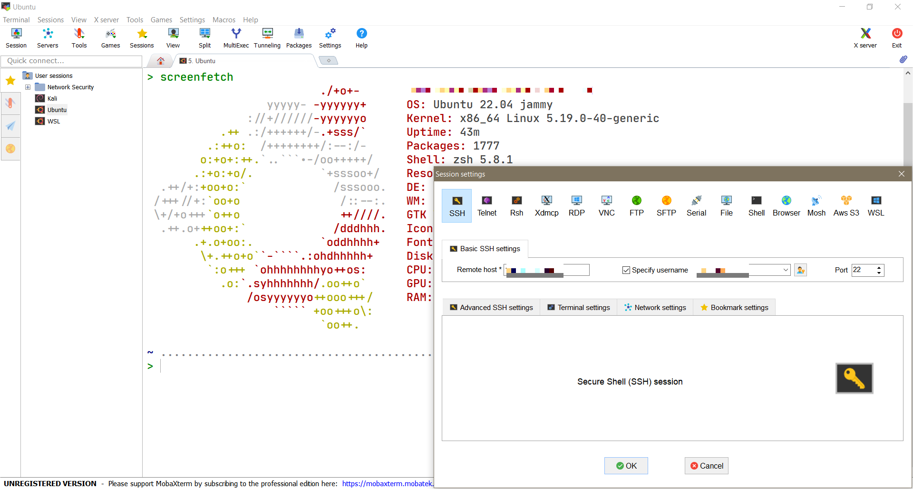

- 在用户目录下创建`.ssh`目录并上传公钥副本

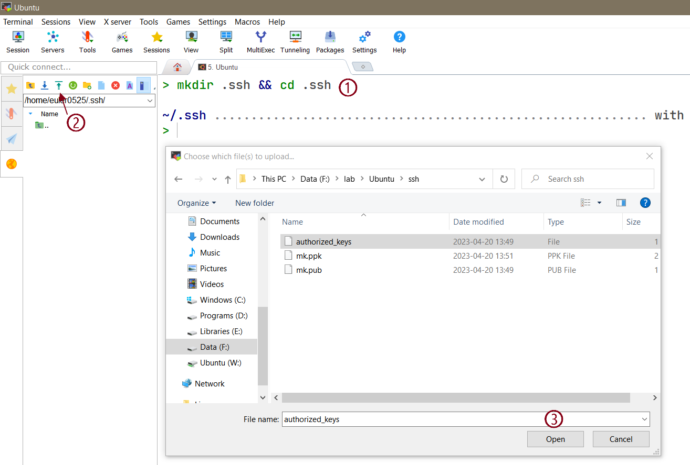

- 添加私钥

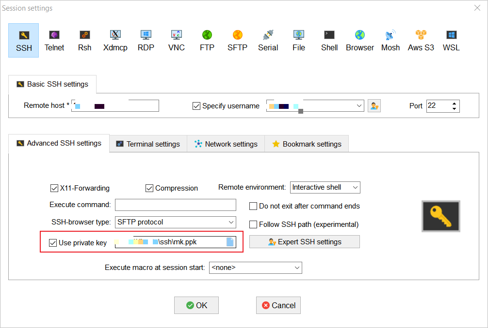

- 关闭MobaXterm与Ubuntu虚拟机的连接，重新连接，自动连接则说明使用私钥连接SSH服务器成功

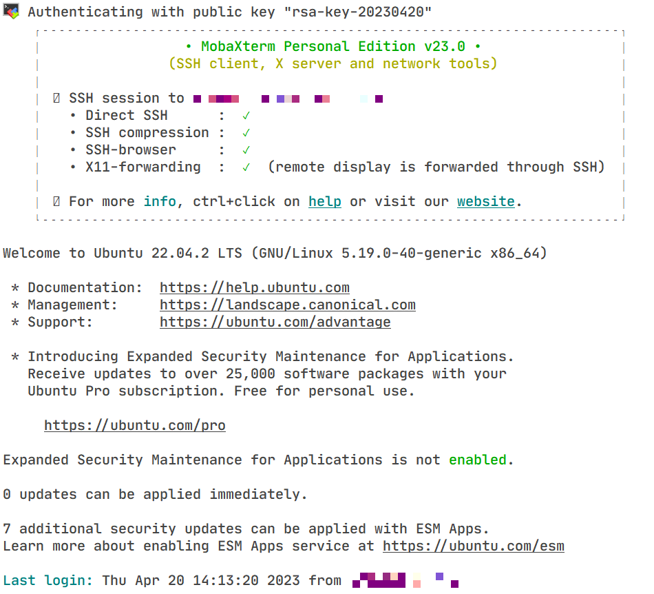

## 实验二：为网站添加HTTPS

### 实验原理

HTTPS是由**SSL+HTTP**构建的网络协议，可进行加密传输和身份认证。其中数字证书是HTTPS实现安全传输的基础，它由权威的CA机构颁发，HTTPS通信流程如下

1. 服务器从可信CA申请证书；
2. 客户端请求与服务器建立连接；
3. 服务器发送网站证书（包含公钥）给客户端；
4. 客户端验证服务器数字证书，验证通过则建立通信；

HTTP协议传输的数据都是明文的，且不校验通信的双方的身份，所以为了安全起见可以采用HTTPS协议进行通信，它是由SSL+HTTP协议构建的可进行加密传输、身份认证的网络协议。数字证书是HTTPS实现安全传输的基础，它由权威的CA机构颁发。HTTPS通信流程大致如下：

1. 服务器可信CA机构申请证书（本实验采用自签名证书）；
2. 客户端请求服务器建立连接
3. 服务器发送网站证书（证书中包含公钥）给客户端
4. 客户端验证服务器数字证书，验证通过则协商建立通信

### 实验环境

- 安装`Nginx`

```shell
sudo apt install nginx -y    # 安装nginx 目录/etc/nginx
sudo systemctl start nginx   # 开启nginx服务
sudo systemctl status nginx  # 查看nginx状态
```

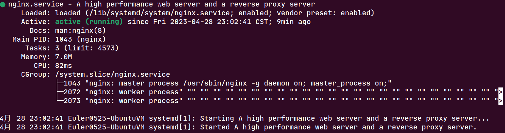

- 开放所需端口

```shell
sudo ufw enable # 打开防火墙
sudo ufw allow 80/tcp
sudo ufw allow 443/tcp
sudo ufw status
```

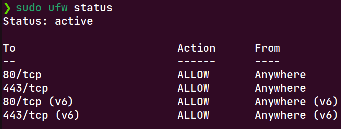

- 检测nginx服务，在浏览器地址栏输入IP地址，出现下图界面则配置成功

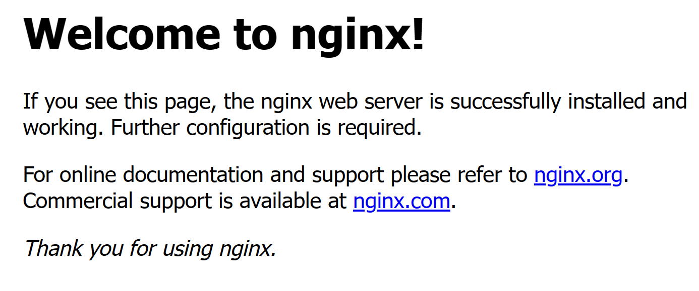

### 实验步骤

- 使用OpenSSL工具生成证书，将生成的证书存储在`/etc/nginx/ssl/`目录下

```shell
sudo openssl req -x509 -nodes -days 365 -newkey rsa:2048 -keyout server.key -out server.crt
```

- 修改**Nginx**配置文件`/etc/nginx/sites-available/default`（已做备份）

```nginx
server {
        listen 80;
        server_name 192.168.177.134;
        return 301 https://$server_name$request_uri;
}

server {
        listen 443 ssl;
        server_name 192.168.177.134;

        ssl_certificate /etc/nginx/ssl/server.crt;
        ssl_certificate_key /etc/nginx/ssl/server.key;

        location / {
                root /var/www/html/;
                index index.html;
        }
}

```

- 重启**Nginx**服务

```shell
sudo systemctl restart nginx
```

