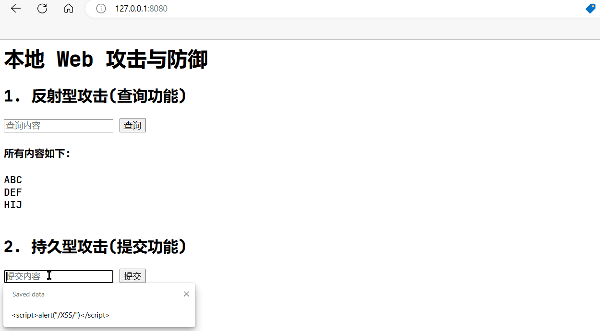
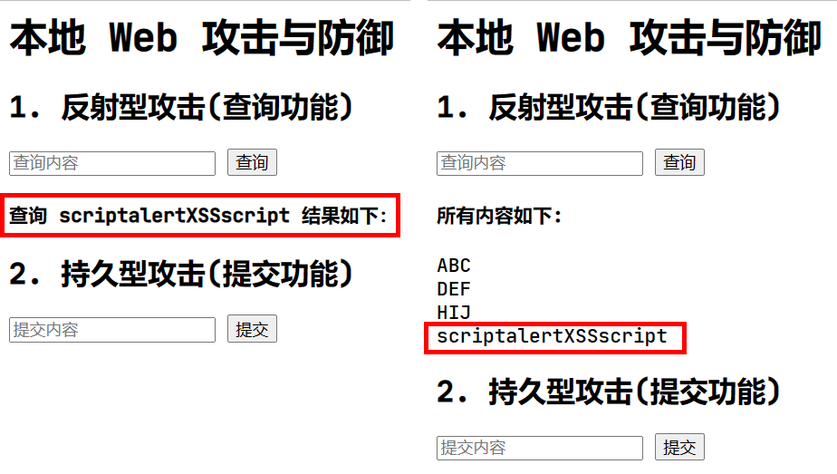

# 第13章实验报告

[TOC]

## 实验名称

实现本地Web攻击和防御

## 实验原理

攻击者利用网页开发时留下的漏洞，向其中注入恶意代码，使用户加载并执行恶意制造的网页程序。

- XSS：攻击者将恶意脚本注入到Web页面中，用户访问时恶意脚本被执行，用于窃取用户的敏感信息；
- CSRF：攻击者伪造用户的请求，在用户无意识的情况下向Web应用程序发起恶意请求；
- SQL注入：攻击者在Web程序中输入特殊的SQL语句，在应用程序中执行未经授权的操作；

## 实验环境

`Python3.9.13`，调用库见附件`requirements.txt`

## 实验步骤

### XSS的攻击和防御

利用Flask框架设计网页的代码见文件`./13/1.py`

运行结果如下图


#### 反射型攻击

```python
query = ""
# 查询
if request.method == "GET":
    if request.args.get("submit") == "查询":
        query = request.args.get("content").strip()
        if query:
            sub_dataset = [x for x in dataset if query in x]
            return render_template("index.html", query=query, comments=sub_dataset)
```

该程序对用户的输入未进行处理，因此存在XSS漏洞，可对网页进行XSS反射型攻击。

查询框输入

```javascript
<script>alert("/XSS/")</script>
```

结果如下


#### 持久型攻击

```python
# 提交
elif request.method == "POST":
    if request.form.get("submit") == "提交":
        comment = request.form.get("input").strip()
        if comment:
            dataset.append(comment)  # 模拟将提交写入数据库
```

程序直接将提交内容加入`dataset`，并未作处理。

在提交框输入下述代码

```javascript
<script>alert("/XSS/")</script>
```

结果如下：


当再次提交时，这段恶意代码会被执行，进行了持久型攻击。



#### XSS攻击的防御

对XSS攻击的防御措施是对用户输入的内容进行处理，修改后的代码如下：

```python
query = ""
# 查询
if request.method == "GET":
    if request.args.get("submit") == "查询":
        query = request.args.get("content").strip()
        # 防御反射型攻击
        query = ''.join(q for q in query if q.isalnum())

        if query:
            sub_dataset = [x for x in dataset if query in x]
            return render_template("index.html", query=query, comments=sub_dataset)
        # 提交
    elif request.method == "POST":
        if request.form.get("submit") == "提交":
            comment = request.form.get("input").strip()
            # 防御持久型攻击
            comment = ''.join(c for c in comment if c.isalnum())
            if comment:
                dataset.append(comment)  # 模拟将提交写入数据库

                return render_template("index.html", query=query, comments=dataset)
```

其中第7行和第17行的目的是只保留输入中字母和数字，删去特殊字符

再次进行反射型攻击和持久型攻击失败：




