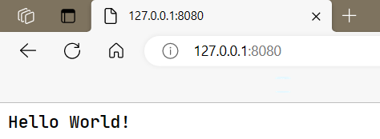
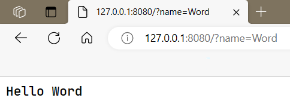
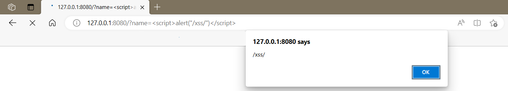
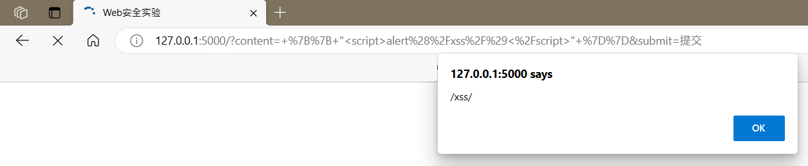

# 第13章实验报告

[TOC]

## 实验名称

实现本地Web攻击和防御

## 实验原理

攻击者利用网页开发时留下的漏洞，向其中注入恶意代码，使用户加载并执行恶意制造的网页程序。

- XSS：攻击者将恶意脚本注入到Web页面中，用户访问时恶意脚本被执行，用于窃取用户的敏感信息；
- CSRF：攻击者伪造用户的请求，在用户无意识的情况下向Web应用程序发起恶意请求；
- SQL注入：攻击者在Web程序中输入特殊的SQL语句，在应用程序中执行未经授权的操作；

## 实验环境

`Python3.9.13`，调用库见附件`requirements.txt`

## 实验步骤

### XSS的攻击和防御

利用Flask框架设计网页的代码见文件`./13/1.py`

```python
from flask import Flask, request
from jinja2 import Template

app = Flask(__name__)


@app.route("/")
def index():
    name = request.args.get('name', 'World!')
    t = Template("Hello " + name)
    return t.render()


if __name__ == "__main__":
    app.run(host="127.0.0.1", port=8080)
    app.config["DEBUG"] = True
```

运行结果如下图



#### 反射型攻击

在地址栏url链接后添加

```javascript
/?name=Word
```

将`name`替换，结果如下



该程序对用户的输入未进行处理，因此存在XSS漏洞。对网页进行XSS反射型攻击，在url连接后添加

```javascript
?name=<script>alert("/xss/")</script>
```

结果如下图



#### 持久型攻击

在提交新评论框输入下述代码，这段指令被执行，结果如下：

```javascript
 {{ "<script>alert(/xss/)</script>" }}
```



审计源代码中这段程序，提交的新评论会被保存，即注入的恶意代码`{{ "<script>alert(/xss/)</script>" }}`被保存，之后再次提交或查询时这段代码被执行，实现了持久型攻击。

```python
# 提交
if request.method == "POST":
    if request.form.get("submit") == "提交":
        comment = request.form.get("input").strip()
        if comment:
            dataset.append(comment)  # 模拟将提交写入数据库
```


### CSRF的攻击与防御


### SQL注入攻击与防御


