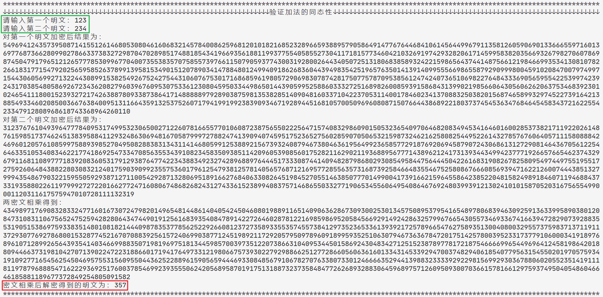
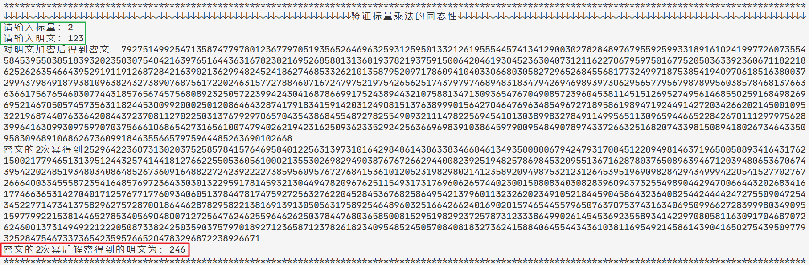
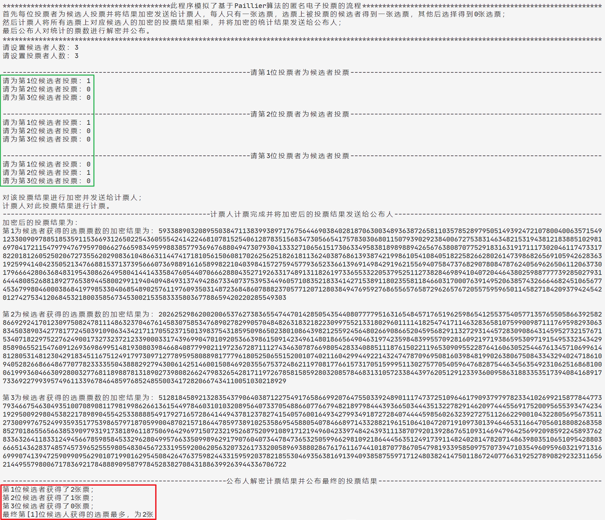

# 第5章实验报告

[TOC]

## 实验名称

基于Paillier 算法的匿名电子投票流程实现

## 实验原理

Paillier算法具有加法和标量乘法加密同态性。

### Paillier方案描述

#### 密钥生成

1. 随机选择两个大素数$p,q$满足$\gcd(pq, (p-1)(q-q))=1$，且$p,q$长度相等（本次实验选择长度均为$1024$）；
2. 计算$n = pq$和$\lambda=\operatorname{lcm}(m, n)$，这里$lcm$表示最小公倍数，$|n|$为$n$的比特长度；
3. 随机选择$g \leftarrow Z_{n^2}^*$（本次实验选择$g=n+1$）；
4. 定义函数$L$：$L(x) = \dfrac{x-1}{n}$，计算$\mu = (L(g^{\lambda}\bmod {n^2}))^{-1}$

得到公钥：$(n, g)$，私钥$(\lambda, \mu)$

#### 加密

1. 输入明文消息$m$，满足$0\leq m\leq n$；
2. 选择随机数$r$满足$0\leq r\leq n$且$r\in Z_n^*$；
3. 计算密文$c = g^mr^n \bmod {n^2}$

#### 解密

1. 输入密文$c$，满足$c\in Z_{n^2}^*$；
2. 计算明文消息$m = L(c^{\lambda}\bmod {n^2})\cdot \mu \bmod{n}$；

$$
\begin{aligned}
d(c) &=L(c^{\lambda}\bmod {n^2})\cdot \mu \bmod{n}\\
&=L((g^mr^n)^{\lambda}\bmod {n^2})\cdot (L(g^{\lambda}\bmod {n^2}))^{-1} \bmod{n}\\
&=L((g^{\lambda})^m \bmod{n^2})\cdot(L(1 + kn))^{-1}\\
&=mk \cdot k^{-1}\\
&= m
\end{aligned}
$$

### 同态加法

对于密文$c_1$和$c_2$，计算$c=c_1 \cdot c_2 \bmod n ^ 2$，明文实现$m_1 + m_2$；
$$
\begin{aligned}
d((c1\cdot c2)\bmod {n ^2}) &= d(g^{m_1} r^n \cdot g^{m_2}r^n \bmod {n^2})\\
&= d(g^{m_1 + m_2}(r^2)^n \bmod {n^2})\\
&=m_1 + m_2\\
\end{aligned}
$$

### 同态标量乘法

同态标量乘：对于密文$c_1$和标量$a$，计算$c=c_1^a \bmod n^2$，明文实现$a\cdot m1$；
$$
\begin{aligned}
d((c_1^a)\bmod {n^2}) &= d(g^{am_1}r^n \bmod {n^2})\\
&= am_1 
\end{aligned}
$$

## 实验步骤

使用`Python`语言实现密钥生成、加密、解密、同态加运算、同态标量乘运算（完整代码见`./img/1.py`）

- 验证加法同态性

- 验证标量乘法同态性

- Paillier算法在电子投票中的应用（完整代码见`./img/2.py`）

