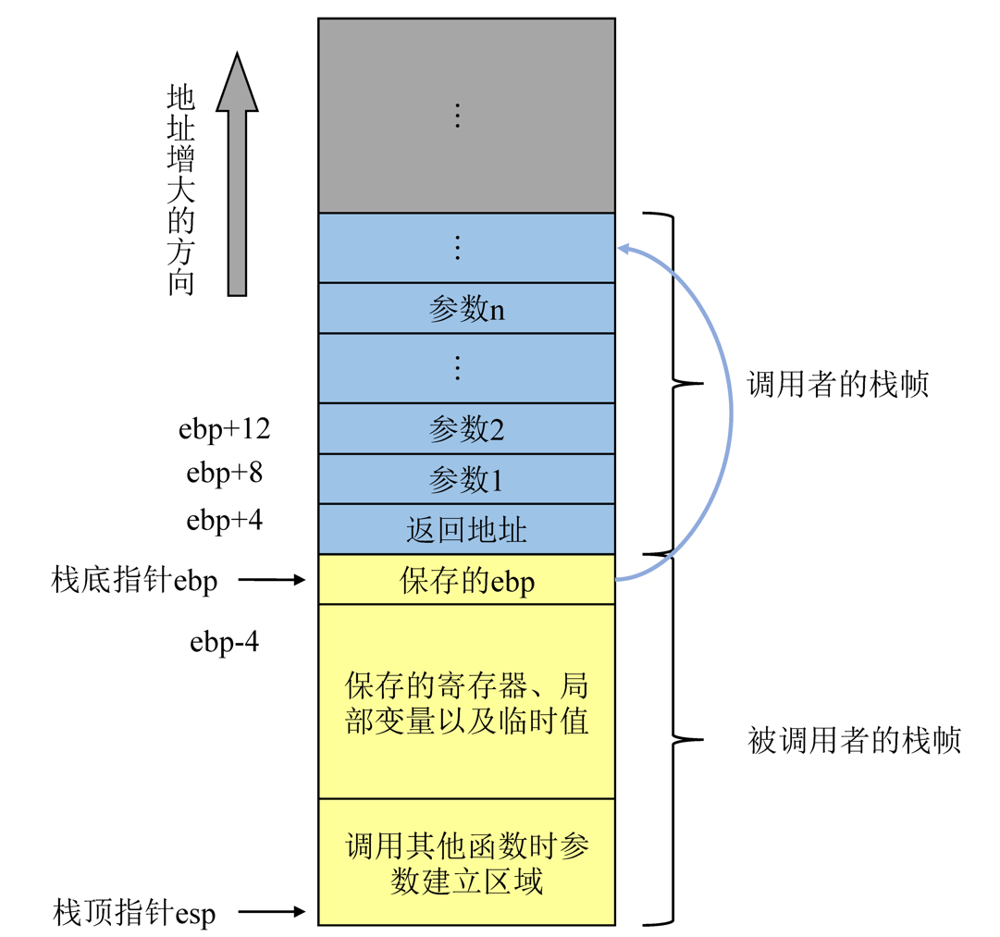
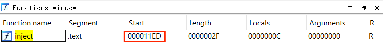
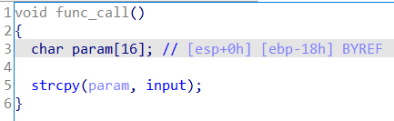

# 第7章实验

[TOC]

## 实验名称

**简单栈溢出实验**

## 实验原理

栈被用于实现函数的调用和存储局部变量，当我们使用`strcpy`或`gets`**没有输入限制**的不安全的函数时，攻击者可以写入超过某个局部变量申请的字节数，使得数据向高地址区覆盖，修改返回地址，让程序按照攻击者的想法运行。



## 实验环境

```shell
# 系统环境
OS: Ubuntu 20.04 focal(on the Windows Subsystem for Linux)
Kernel: x86_64 Linux 5.15.90.1-microsoft-standard-WSL2
CPU: AMD Ryzen 7 5700U with Radeon Graphics @ 16x 1.797GHz
RAM: 1677MiB / 6858MiB
# gcc
gcc (Ubuntu 9.4.0-1ubuntu1~20.04.1) 9.4.0
# gdb
GNU gdb (Ubuntu 9.2-0ubuntu1~20.04.1) 9.2
# objdump
GNU objdump (GNU Binutils for Ubuntu) 2.34
```

## 实验步骤

### 准备阶段

- 更新`gcc, gdb,checksec`

```shell
❯ apt update
❯ apt install gcc-multilib
❯ apt install gdb
❯ apt install checksec
```

- 关闭进程空间地址随机化

```shell
# 首先看一下地址随机化的效果，可以发现在ASLR开启时，动态库的加载地址不同
❯ ldd /bin/bash
        linux-vdso.so.1 (0x00007fffb3dc4000)
        libtinfo.so.6 => /lib/x86_64-linux-gnu/libtinfo.so.6 (0x00007f6cef006000)
        libdl.so.2 => /lib/x86_64-linux-gnu/libdl.so.2 (0x00007f6cef000000)
        libc.so.6 => /lib/x86_64-linux-gnu/libc.so.6 (0x00007f6ceee0e000)
        /lib64/ld-linux-x86-64.so.2 (0x00007f6cef171000)
❯ ldd /bin/bash
        linux-vdso.so.1 (0x00007ffc82124000)
        libtinfo.so.6 => /lib/x86_64-linux-gnu/libtinfo.so.6 (0x00007f710a76b000)
        libdl.so.2 => /lib/x86_64-linux-gnu/libdl.so.2 (0x00007f710a765000)
        libc.so.6 => /lib/x86_64-linux-gnu/libc.so.6 (0x00007f710a573000)
        /lib64/ld-linux-x86-64.so.2 (0x00007f710a8d6000)
# 关闭地址随机化
❯ sysctl -w kernel.randomize_va_space=0
kernel.randomize_va_space = 0
# 再次查看动态库的加载地址，可以看到两次加载的地址完全相同
❯ ldd /bin/bash
        linux-vdso.so.1 (0x00007ffff7fcd000)
        libtinfo.so.6 => /lib/x86_64-linux-gnu/libtinfo.so.6 (0x00007ffff7e5e000)
        libdl.so.2 => /lib/x86_64-linux-gnu/libdl.so.2 (0x00007ffff7e58000)
        libc.so.6 => /lib/x86_64-linux-gnu/libc.so.6 (0x00007ffff7c66000)
        /lib64/ld-linux-x86-64.so.2 (0x00007ffff7fcf000)
❯ ldd /bin/bash
        linux-vdso.so.1 (0x00007ffff7fcd000)
        libtinfo.so.6 => /lib/x86_64-linux-gnu/libtinfo.so.6 (0x00007ffff7e5e000)
        libdl.so.2 => /lib/x86_64-linux-gnu/libdl.so.2 (0x00007ffff7e58000)
        libc.so.6 => /lib/x86_64-linux-gnu/libc.so.6 (0x00007ffff7c66000)
        /lib64/ld-linux-x86-64.so.2 (0x00007ffff7fcf000)
```

- 编写测试程序如下：

```c
#include <stdio.h>
#include <string.h>
#include <stdlib.h>

char input[] = "11112222333344445555666677778888";

void inject()
{
    printf("*****inject success*****\n");
}

void func_call()
{
    char param[16];
    strcpy(param, input);
}

int main(int argc, char** argv)
{
    func_call();
    printf("main exit...\n");
    return 0;
}

```

- 运行程序并检测保护机制

```shell
❯ gcc StackOverflow.c -o StackOverflow -Wall -m32 -g -fno-stack-protector -z execstack
# -Wall: 开启所有常规警告，便于检测代码问题
# -o: 指定输出文件名
# -g: 关闭所有优化体制
# -fno-stack-protector: 关闭Stack Canary保护
# -z execstack: 禁用 NX(No-eXecute protect)
# -m32: 将编译目标指定为32位

# 使用checksec检测目标文件的保护机制，确实没有Canary和NX保护
❯ checksec --file=StackOverflow
[*] '/root/StackOverflow'
    Arch:     i386-32-little
    RELRO:    Full RELRO
    Stack:    No canary found
    NX:       NX disabled
    PIE:      PIE enabled
    RWX:      Has RWX segments
    
# 查看运行结果
❯ ./StackOverflow
main exit...
```

### 实验阶段

经过一番准备，下面正式开始栈溢出攻击的实验。

#### 动态调试

使用`gdb`工具（已安装`gef`插件），具体过程如下

- 查看`main`函数的汇编代码`disassemble main`

```asm
Dump of assembler code for function main:
=> 0x5655624f <+0>:     endbr32
   0x56556253 <+4>:     lea    ecx,[esp+0x4]
   0x56556257 <+8>:     and    esp,0xfffffff0
   0x5655625a <+11>:    push   DWORD PTR [ecx-0x4]
   0x5655625d <+14>:    push   ebp
   0x5655625e <+15>:    mov    ebp,esp
   0x56556260 <+17>:    push   ebx
   0x56556261 <+18>:    push   ecx
   0x56556262 <+19>:    call   0x565560f0 <__x86.get_pc_thunk.bx>
   0x56556267 <+24>:    add    ebx,0x2d6d
   0x5655626d <+30>:    call   0x5655621c <func_call>
   0x56556272 <+35>:    sub    esp,0xc
   0x56556275 <+38>:    lea    eax,[ebx-0x1fb3]
   0x5655627b <+44>:    push   eax
   0x5655627c <+45>:    call   0x56556090 <puts@plt>
   0x56556281 <+50>:    add    esp,0x10
   0x56556284 <+53>:    mov    eax,0x0
   0x56556289 <+58>:    lea    esp,[ebp-0x8]
   0x5655628c <+61>:    pop    ecx
   0x5655628d <+62>:    pop    ebx
   0x5655628e <+63>:    pop    ebp
   0x5655628f <+64>:    lea    esp,[ecx-0x4]
   0x56556292 <+67>:    ret
End of assembler dump.
```

- 查看`func_call`的汇编代码`disassemble func_call`

```asm
Dump of assembler code for function func_call:
   0x5655621c <+0>:     endbr32
   0x56556220 <+4>:     push   ebp
   0x56556221 <+5>:     mov    ebp,esp
   0x56556223 <+7>:     push   ebx
   0x56556224 <+8>:     sub    esp,0x14
   0x56556227 <+11>:    call   0x56556293 <__x86.get_pc_thunk.ax>
   0x5655622c <+16>:    add    eax,0x2da8
   0x56556231 <+21>:    sub    esp,0x8
   0x56556234 <+24>:    lea    edx,[eax+0x34]
   0x5655623a <+30>:    push   edx
   0x5655623b <+31>:    lea    edx,[ebp-0x18]
   0x5655623e <+34>:    push   edx
   0x5655623f <+35>:    mov    ebx,eax
   0x56556241 <+37>:    call   0x56556080 <strcpy@plt>
   0x56556246 <+42>:    add    esp,0x10
   0x56556249 <+45>:    nop
   0x5655624a <+46>:    mov    ebx,DWORD PTR [ebp-0x4]
   0x5655624d <+49>:    leave
   0x5655624e <+50>:    ret
End of assembler dump.
```

- 调试

```shell
b func_call  # 在func_call函数开始处设置断点
r            # 运行至断点处

p inject     # 查看inject函数
$1 = {void ()} 0x565561ed <inject>
p input      # 查看input
$2 = 0x56559009 <input> ""
p &param     # 查看param地址
$3 = (char (*)[16]) 0xffffce80

b strcpy     # 在strcpy处设置断点
info b       # 查看断点信息
Num     Type           Disp Enb Address    What
1       breakpoint     keep y   0x5655621c in func_call at StackOverflow.c:13
        breakpoint already hit 1 time
2       breakpoint     keep y   0xf7e58740 ../sysdeps/i386/i686/multiarch/strcpy-ssse3.S:75
r            # 运行至断点处

r            # 运行到第1个断点
c            # 运行到第2个断点
x/40xw $esp  # 查看栈上的数据
0xffffce6c:     0x56556246      0xffffce80      0x56559009      0x00000000
0xffffce7c:     0x5655622c      0xf7fb53fc      0x00000001      0x56558fd4
0xffffce8c:     0x565562f3      0x00000001      0x56558fd4      0xffffcea8
0xffffce9c:     0x56556272      0xffffcec0      0x00000000      0x00000000
0xffffceac:     0xf7de4ed5      0xf7fb5000      0xf7fb5000      0x00000000
0xffffcebc:     0xf7de4ed5      0x00000001      0xffffcf54      0xffffcf5c
0xffffcecc:     0xffffcee4      0xf7fb5000      0xf7ffd000      0xffffcf38
0xffffcedc:     0x00000000      0xf7ffd990      0x00000000      0xf7fb5000
0xffffceec:     0xf7fb5000      0x00000000      0x632b4f1d      0x202be90d
0xffffcefc:     0x00000000      0x00000000      0x00000000      0x00000000
```


#### 静态调试

- 打开IDA_Prox32，找到`inject`函数



- 找到`param`的位置




